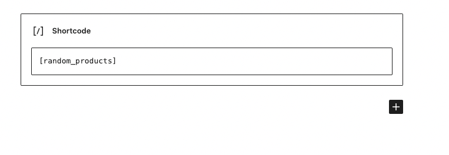
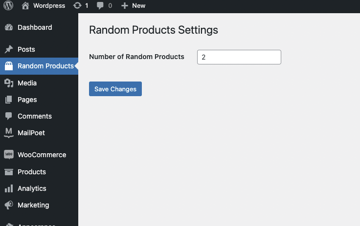

# Acceptance Criteria
- The plugin must have a page that could be accessed from the WordPress admin (wp-admin).
- The plugin must have a link in the wp-admin side menu that leads to the plugin dashboard.
- The shortcode should return random products.
- The number of the products returned could be changed from the plugin admin page.
- The plugin should handle shortcode [random_products]
README file contains documentation about the plugin.

# View on storefront

This is the view on storefront.
In order to add shortcode, please do next:

1. Go to the page (post) you want to add shortcut to.
2. Add shortcode [random_products] to the page content.
3. Save the page.

# Config number of products

In order to config number of random products, you need:
1. Go to the plugin admin page. (please refer to the menu item that is on the page)
2. Change the number of products. (please see screenshot)
3. Save the changes.
4. 